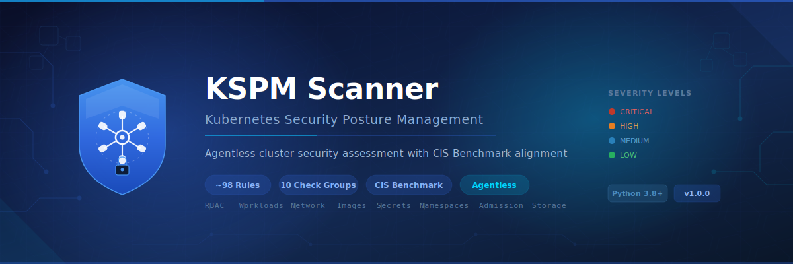

<p align="center">
  
</p>

# Kubernetes Security Posture Management (KSPM) Scanner

An open-source, agentless Python-based **Kubernetes Security Posture Management (KSPM)** tool that connects to a live Kubernetes cluster via the Kubernetes API and performs comprehensive security posture assessments.

**No agents, sidecars, or DaemonSets required** — the scanner uses your existing kubeconfig or in-cluster service account to query the Kubernetes API directly.

---

## Features

- **~120+ security checks** across 16 check groups
- **CIS Kubernetes Benchmark** mapping for 25+ rules
- **Agentless** — connects via kubeconfig or in-cluster config
- **All workload types** — Deployments, StatefulSets, DaemonSets, Jobs, CronJobs
- **Managed cluster support** — graceful handling for EKS, GKE, AKS where API server pods aren't visible
- **Triple output** — colored console, JSON, interactive HTML (dark theme with JS filtering)
- **Exit codes** — returns `1` if CRITICAL or HIGH findings, `0` otherwise (CI/CD friendly)

---

## Check Groups (~120+ Rules)

| # | Category | Rule IDs | Key Checks |
|---|----------|----------|------------|
| 1 | **RBAC Security** | K8S-RBAC-001 to 015 | Cluster-admin bindings, wildcard permissions, secrets access, pod exec/attach, escalate/bind/impersonate verbs, anonymous/unauthenticated bindings, CSR approval, SA token creation |
| 2 | **Workload Security** | K8S-POD-001 to 025 | Privileged containers, root user, hostNetwork/PID/IPC, privilege escalation, capabilities (SYS_ADMIN/ALL/NET_RAW), readOnlyRootFilesystem, resource limits/requests, liveness/readiness probes, seccomp, AppArmor/SELinux, process namespace sharing, unsafe sysctls |
| 3 | **Image Security** | K8S-IMG-001 to 005 | `latest` tag, missing tag, pull policy not Always, untrusted registry, missing digest |
| 4 | **Network Security** | K8S-NET-001 to 010 | Missing network policies, allow-all ingress/egress, LoadBalancer/NodePort exposure, ExternalIPs, Ingress without TLS, wildcard hosts, ExternalName services |
| 5 | **Namespace Security** | K8S-NS-002 to 006 | Pod Security Admission labels (enforce/warn/audit), PSA level not restricted, missing ResourceQuota, missing LimitRange |
| 6 | **Secret Management** | K8S-SECRET-001 to 006 | Secrets in env vars, sensitive ConfigMap keys (password/token/api_key patterns), incomplete TLS secrets |
| 7 | **Service Accounts** | K8S-SA-001 to 004 | Default SA with ClusterRoleBindings, auto-mount tokens, SA bound to cluster-admin, unused service accounts |
| 8 | **Cluster Configuration** | K8S-CLUSTER-001 to 010 | API server (anonymous auth, insecure port, audit logging, admission controllers, encryption at rest, profiling), Kubernetes Dashboard exposure, Tiller (Helm v2) detection, non-system hostNetwork pods |
| 9 | **Storage Security** | K8S-PV-001 to 004 | hostPath PersistentVolumes, deprecated Recycle policy, ReadWriteMany PVCs, emptyDir without sizeLimit |
| 10 | **Admission Control** | K8S-ADM-001 to 005 | Webhook failurePolicy Ignore, missing namespace selector, overly broad scope, high timeout, no validating webhooks |
| 11 | **Node Security** | K8S-NODE-001 to 006 | Outdated kubelet/K8s version, outdated container runtime, node health (NotReady, pressure), missing topology labels, control plane without NoSchedule taint, old kernel version |
| 12 | **Availability (PDB)** | K8S-PDB-001 to 003 | Deployments/StatefulSets without PDB, PDB maxUnavailable=0, PDB minAvailable=100% |
| 13 | **Availability (HPA)** | K8S-HPA-001 to 004 | minReplicas=1, min equals max, target without resource requests, no scale-down stabilization |
| 14 | **Service Mesh** | K8S-MESH-001 to 004 | Missing sidecar injection (Istio/Linkerd), permissive/disabled mTLS, missing AuthorizationPolicy, exposed mesh gateways |
| 15 | **Deprecated APIs** | K8S-API-001 to 003 | Deprecated API versions in use, removed APIs still present, PodSecurityPolicy remnants |
| 16 | **Runtime Security** | K8S-RC-001, K8S-EPH-001/002 | Non-existent RuntimeClass references, active ephemeral debug containers, privileged ephemeral containers |

---

## CIS Kubernetes Benchmark Mapping

Rules are mapped to CIS Kubernetes Benchmark sections where applicable:

| Scanner Rule | CIS Reference | Description |
|-------------|---------------|-------------|
| K8S-RBAC-001 | CIS 5.1.1 | Cluster-admin role usage |
| K8S-POD-001 | CIS 5.2.1 | Privileged containers |
| K8S-POD-002 | CIS 5.2.6 | Root containers |
| K8S-POD-003 | CIS 5.2.4 | Host network access |
| K8S-NET-001 | CIS 5.3.2 | Network policy enforcement |
| K8S-CLUSTER-001 | CIS 1.2.1 | API server anonymous auth |
| K8S-CLUSTER-003 | CIS 1.2.22 | Audit logging |
| K8S-CLUSTER-005 | CIS 1.2.29 | Encryption at rest |
| K8S-NODE-001 | CIS 4.1.1 | Kubelet version |
| K8S-NODE-002 | CIS 4.2.6 | Container runtime version |
| K8S-NODE-005 | CIS 4.2.12 | Control plane taints |
| ... | ... | 25+ mappings total |

---

## Installation

```bash
# Install the Kubernetes Python client
pip install kubernetes
```

No other dependencies required — the scanner uses only the `kubernetes` library and Python standard library.

---

## Usage

```bash
# Scan using default kubeconfig (~/.kube/config)
python kspm_scanner.py

# Scan with HTML and JSON reports
python kspm_scanner.py --html report.html --json scan.json

# Scan a specific context
python kspm_scanner.py --context production-cluster

# Scan specific namespace(s)
python kspm_scanner.py --namespace app-ns,staging-ns

# Show only HIGH and CRITICAL findings
python kspm_scanner.py --severity HIGH

# Scan with explicit kubeconfig file
python kspm_scanner.py --kubeconfig /path/to/kubeconfig --html report.html

# Verbose output for debugging
python kspm_scanner.py -v --severity MEDIUM --html report.html
```

### CLI Reference

```
usage: kspm_scanner.py [-h] [--kubeconfig FILE] [--context CTX]
                       [--namespace NS] [--all-namespaces]
                       [--severity {CRITICAL,HIGH,MEDIUM,LOW}]
                       [--json FILE] [--html FILE]
                       [--verbose] [--version]

Options:
  --kubeconfig, -k FILE   Path to kubeconfig file (env: KUBECONFIG)
  --context, -c CTX       Kubernetes context to use (env: K8S_CONTEXT)
  --namespace, -n NS      Scan specific namespace(s), comma-separated
  --all-namespaces, -A    Scan all namespaces (default)
  --severity LEVEL        Minimum severity to report (default: LOW)
  --json FILE             Save JSON report to FILE
  --html FILE             Save interactive HTML report to FILE
  --verbose, -v           Enable verbose output
  --version               Show version and exit
```

### Environment Variables

| Variable | Description |
|----------|-------------|
| `KUBECONFIG` | Path to kubeconfig file |
| `K8S_CONTEXT` | Kubernetes context to use |

---

## Output Formats

### Console Output
Color-coded findings sorted by severity with CIS benchmark references:
```
[CRITICAL]  K8S-POD-001  Privileged container
  Resource : production/Deployment/api-server/main
  Detail   : privileged: true
  CIS      : CIS 5.2.1
  Issue    : Container runs with full host privileges, disabling all security boundaries.
  Fix      : Set privileged: false. Use specific capabilities instead.
```

### HTML Report
Interactive dark-themed report with:
- Severity summary chips
- Dropdown filters (severity, category)
- Text search across all findings
- CIS benchmark references inline
- Kubernetes blue gradient header

### JSON Report
Machine-parseable output for CI/CD integration:
```json
{
  "scanner": "kspm_scanner",
  "version": "1.0.0",
  "cluster": "production",
  "findings_count": 42,
  "summary": {"CRITICAL": 3, "HIGH": 12, "MEDIUM": 18, "LOW": 9},
  "findings": [...]
}
```

---

## CI/CD Integration

The scanner returns exit code `1` if CRITICAL or HIGH findings are present, making it suitable for pipeline gates:

```yaml
# GitHub Actions example
- name: KSPM Security Scan
  run: |
    pip install kubernetes
    python kspm_scanner.py --severity HIGH --json kspm-results.json --html kspm-report.html
  continue-on-error: false
```

---

## Required RBAC Permissions

For a read-only scan, the service account or user needs the following minimum permissions:

```yaml
apiVersion: rbac.authorization.k8s.io/v1
kind: ClusterRole
metadata:
  name: kspm-scanner-reader
rules:
- apiGroups: [""]
  resources: ["namespaces", "pods", "services", "serviceaccounts",
              "configmaps", "secrets", "persistentvolumes",
              "persistentvolumeclaims", "resourcequotas", "limitranges", "nodes"]
  verbs: ["get", "list"]
- apiGroups: ["apps"]
  resources: ["deployments", "statefulsets", "daemonsets", "replicasets"]
  verbs: ["get", "list"]
- apiGroups: ["batch"]
  resources: ["jobs", "cronjobs"]
  verbs: ["get", "list"]
- apiGroups: ["networking.k8s.io"]
  resources: ["networkpolicies", "ingresses"]
  verbs: ["get", "list"]
- apiGroups: ["rbac.authorization.k8s.io"]
  resources: ["roles", "rolebindings", "clusterroles", "clusterrolebindings"]
  verbs: ["get", "list"]
- apiGroups: ["admissionregistration.k8s.io"]
  resources: ["validatingwebhookconfigurations", "mutatingwebhookconfigurations"]
  verbs: ["get", "list"]
```

---

## License

This project is licensed under the MIT License — see the [LICENSE](LICENSE) file for details.
